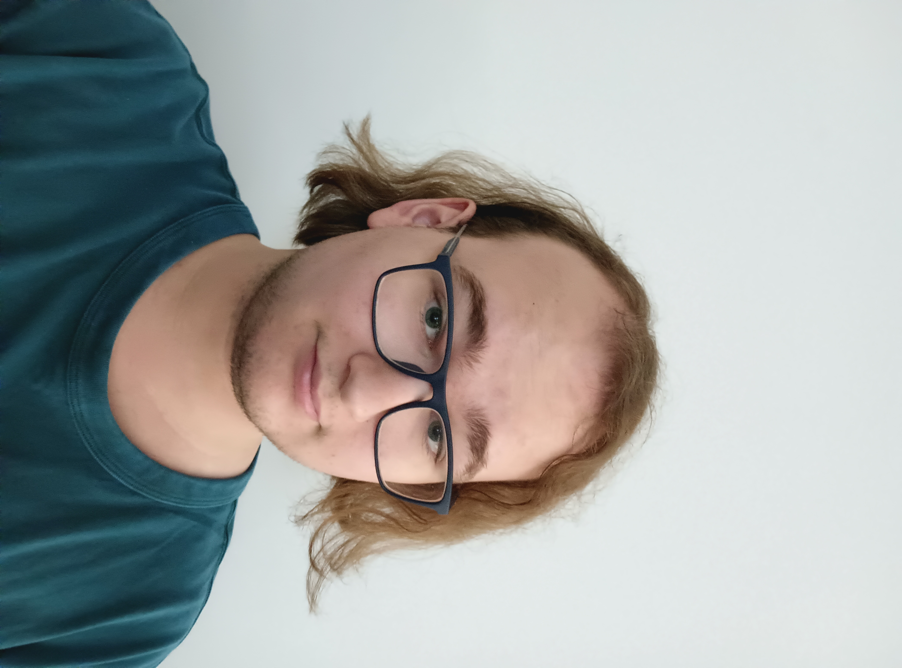
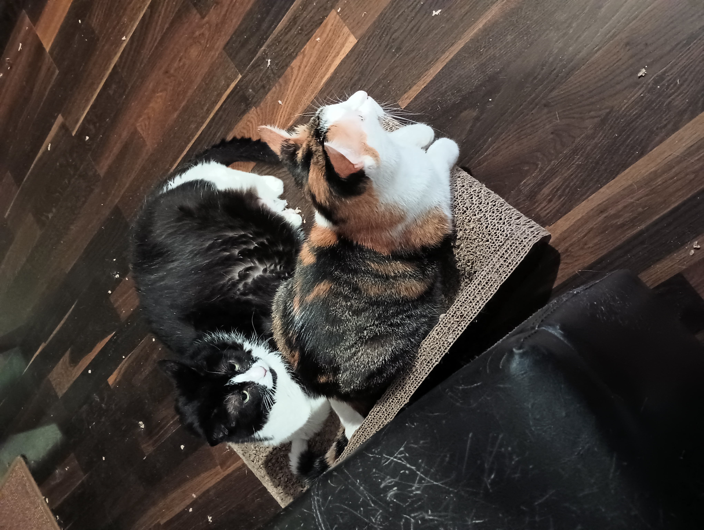
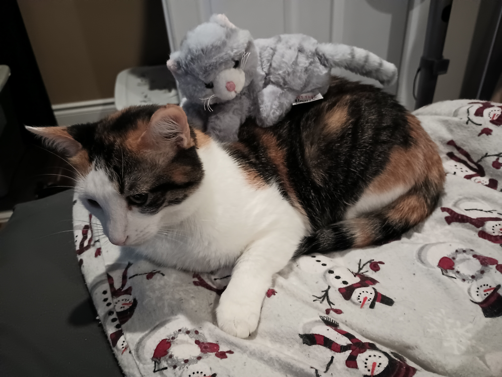

# Tegan Bathurst-Alden
## Likes:
- My dog Tilly
- Concerts
- Rock/metal/emo/punk/alternative music
     - Billy Talent
     - Avenged Sevenfold
     - Ghost
     - My Chemical Romance
     - Ice Nine Kills
     - TOOL
     - I Don't Know How But They Found Me
     - Maneskin
     - etc.
- The colour black
- Walking at night
- Anime
- Mahito from Jujutsu Kaisen

This is a picture of my dog:

This is a picture of Ben Kowalewicz from Billy Talent being given a printed copy of MY artwork!:

## Hobbies:
- Going for scooter rides with Tilly
- Drawing
- Sewing
- Cosplay
- Playing video games
- Listening to music
- Going to concerts
- Watching new shows
- Embroidery
- Playing baseball

This is a picture of me at Rock Am Ring 2024 in Germany:

This is a drawing I made of Mahito from Jujutsu Kaisen

## Dislikes:
- People
- The sun
- Silence
- Sweating
- Sand
- Microfiber cloths
- Onions

## Fun Facts:
- I've had more dental procedures than doctor's appointments
- I've only placed 1st in one art competition
- I've seen Billy Talent 4 times, Ghost once, Avenged Sevenfold once, Maneskin twice, and My Chemical Romance once
- I have Tilly registered and trained to be an emotional support dog
- I have more dislikes than likes, but I kept the list short
- I have been to Germany and the UK 
- I originally hated dogs, but Tilly changed that opinion for me

# Alexander Pritchard

## Likes:
- My cats Bella and Sadie
- Gaming
- Many kinds of rock music. Alt, funk, psych, etc.
- Drawing
- Fighting games
- Manga
- Marvel Comics
- The fighting game community here in London, the LFGC

## Dislikes
- Loud Places
- Too many people talking at once
- Drawing negative attention
- Celery
- Olives
- That feeling of microfiber
- Having my belongings moved / my order of things changed

## Background
- Born in Mississauga, grew up in Milton
- Moved about 7 times throughout my life between my parents
- raised catholic, attended catholic elementary and high schools, but am no longer religious
- Have had numerous ear infections throughout my life, recieved 3 surgeries for it

# About Me GitHub Project
Our GitHub collaborative project.

## Installation
Open GitHub link.

## Usage
Read the README file.

## Contributing:
1. Fork it!
2. Create your feature branch: git checkout -b my-new-feature
3. Commit your changes: git commit -am 'Add some feature'
4. Push to the branch: git push origin my-new-feature
5. Submit a pull request :D

## History
TODO: Write history.

## Credits
Tegan Bathurst-Alden
Alexander Pritchard

## License
MIT License.