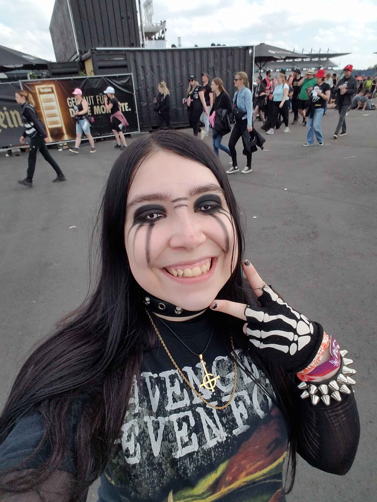

# Tegan Bathurst-Alden
## Likes:
- My dog Tilly
- Concerts
- Rock/metal/emo/punk/alternative music
     - Billy Talent
     - Avenged Sevenfold
     - Ghost
     - My Chemical Romance
     - Ice Nine Kills
     - TOOL
     - I Don't Know How But They Found Me
     - Maneskin
     - etc.
- The colour black
- Walking at night
- Anime
- Mahito from Jujutsu Kaisen

This is a picture of my dog:

This is a picture of Ben Kowalewicz from Billy Talent being given a printed copy of MY artwork!:

## Hobbies:
- Going for scooter rides with Tilly
- Drawing
- Sewing
- Cosplay
- Playing video games
- Listening to music
- Going to concerts
- Watching new shows
- Embroidery
- Playing baseball

This is a picture of me at Rock Am Ring 2024 in Germany:

This is a drawing I made of Mahito from Jujutsu Kaisen

## Dislikes:
- People
- The sun
- Silence
- Sweating
- Sand
- Microfiber cloths
- Onions

## Fun Facts:
- I've had more dental procedures than doctor's appointments
- I've only placed 1st in one art competition
- I've seen Billy Talent 4 times, Ghost once, Avenged Sevenfold once, Maneskin twice, and My Chemical Romance once
- I have Tilly registered and trained to be an emotional support dog
- I have more dislikes than likes, but I kept the list short
- I have been to Germany and the UK 
- I originally hated dogs, but Tilly changed that opinion for me